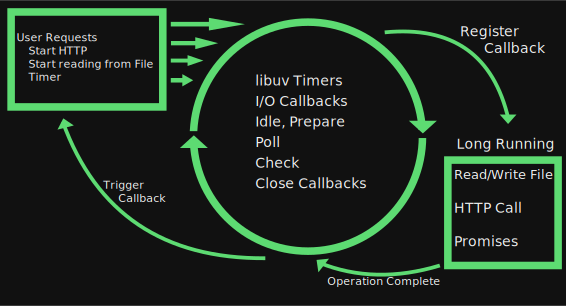

- title : WTF is Node.js
- description : A guide for .Net and Java developers
- author : Kai Ito
- theme : night
- transition : default

***

    

## WTF is Node.js
### A guide for .Net and Java developers

   

* Kai Ito
* https://www.xing.com/profile/Kai_Ito/
* https://github.com/kaeedo/WtfIsNode

' Little bit about me

***

### What is Node.js

* Javascript runtime for the server

---

### Thank you?

* Any Questions?

***

### What is Node.js

* Javascript runtime for the server
* Initial release May 2009
* Utilizes Chrome V8 Javascript engine
* Now belongs to The Node.js Foundation
* Open Source

---

### Installation and Versions

* Current Stable version is 12.1.0 (April 29, 2019)
* Node.js vs IO.js
* Use Node Version Manager

' Why multiple versions are necessary

---

### Topics in this talk

* Event Loop
* Ecosystem
* What does Node.js offer that other runtimes don't

' We are not going to talk about Javascript as a language, but only Node.js as a runtime

***

### Event Loop

* Perhaps most important part of Node.js
* Single threaded
* Everything is asynchronous

---

### libuv

* Low level library that enables the event loop
* Fixed size thread pool
* The main thread sends tasks to thread pool
* Upon completion, informs main thread to execute callback

---

### Event Loop

---

### Event-driven programming

* Non-Blocking I/O
* Any function performing I/O must use a callback
* Mainly used for Web Servers and I/O heavy services

' Not suitable for CPU intensive tasks

---

### Scaling

* No thread context switch
* Suitable for I/O operation
* CPU bound tasks are slow
* Only horizontal scaling
  * There are modules that allow for multi-threaded operation

---

### Code example

' eventLoop directory
' Callback, Pyramid of Doom, Promises, async/await

***

### Node.js ecosystem

---

### Modules
* CommonJS
* AMD
* ES2015
  * *.mjs

' Show examples
' modules directory
' node --experimental-modules .\index.mjs

---

### NPM

* NPM Scripts
* NPM vs Yarn
* node_modules

' ^ matches 1.x.x
' Show examples

---

### left-pad

* Problem with NPM transitive dependencies
* package-lock.json
* Bitcoin wallet attack

---

### Compile to JS languages

* Typescript
* F#
* Kotlin

' Show TS examples

---

### Frameworks

* Express
* Node Red
* Meteor

' Show express examples

***

### What can I do with Node

* Code sharing between Client and Server
* Isomorphic (universal) Javascript
  * Server Side rendering of client side frameworks

---

### Code Sharing

* Business Logic
* Validation
* Markup (More on that later)

---

### Isomorphic (Universal) Javascript

* Render the landing page of a SPA on the server
* SEO
* Allow client side framework to continue to handle the generated HTML on the client

' Show examples

---

### Thank you?

* Any Questions?
